<p align="center">
  
</p>

<p align="center">
  
  
  
  
  
</p>

---

## Overview

Humanoid Auto-Typer is an open-source research extension for Chromium browsers engineered to simulate biomechanical human typing patterns on typing benchmark platforms, including [Monkeytype](https://monkeytype.com) and [Keybr](https://www.keybr.com).

Traditional automation tools generate uniform delays and flat speed graphs that immediately trigger anti-cheat algorithms. This project implements a closed-loop neuromuscular motor model featuring Gaussian latency variance, asynchronous key rollover, physical switch dwell times, macro-wave focus drift, and frame-rate decoupled word sequence streaming up to 500 WPM.

---

## Motor Dynamics and Evasion Model

| Metric | Basic Macro / Script | Human Typist | Humanoid Engine |
|---|---|---|---|
| Latency Distribution | Uniform / Static (e.g. 50ms) | Gaussian Variance | Gaussian (Box-Muller Transform) |
| Consistency Graph | 98% - 100% (Flagged) | 70% - 88% (Natural Drift) | 75% - 88% (Configurable Waves) |
| Key Rollover | Sequential (0ms Overlap) | Concurrent (10ms - 25ms) | Asymmetric Rollover Modeling |
| Key Dwell Times | Instantaneous (0ms - 2ms) | Varied by Finger Strength | 10ms - 45ms Physical Actuation |
| Max Throughput | Hardware / Event Loop Bound | ~180 - 290 WPM (World Elite) | Scalable 30 - 500 WPM |
| Framework Overhead | Often requires build tools | N/A | Zero Dependencies (Vanilla JS) |

### Key Mechanics

* **Asymmetric Key Rollover**: In authentic fast typing, the subsequent key is depressed before the preceding key has fully released. The engine calculates dynamic overlap intervals, releasing keys asynchronously while queuing new inputs.
* **Biomechanical Dwell Times**: Dwell duration scales based on anatomical key assignments: the spacebar thumb strike retains contact longer than agile home-row strikes, while outer pinky reach keys require deliberate actuation times.
* **Macro-Wave Velocity Drift**: A continuous sinusoidal variance is layered onto keystroke cadences to replicate human mental focus cycles, producing authentic, non-flat speed curves on performance graphs.
* **Closed-Loop Pacing Compensator**: A PID-style feedback loop measures real-time elapsed duration against target throughput, smoothly accelerating or decelerating micro-intervals without generating detectable plateaus.
* **Frame-Rate Decoupled Streaming**: Eliminates browser rendering bottlenecks (60 Hz / 16.6ms frame ceilings) by dispatching word sequences via internal high-precision motor timelines, synchronizing with the DOM only at spacebar word boundaries.

---

## Architecture

```text
[ Browser Tab (Monkeytype / Keybr) ]
         │
         ├── In-Page HUD (Shadow DOM v1 Encapsulation)
         │       └── Controls: WPM Slider, Presets, Live Status
         │
         ├── Content Coordinator (content-main.js)
         │       ├── Auto-Takeover Listener (User Keydown Detection)
         │       └── Hotkey Handler (Alt+T, Alt+P, Alt+S, Alt+Up/Down)
         │
         ├── Humanoid Motor Engine (humanoid-engine.js)
         │       ├── Gaussian Variance Generator
         │       ├── Dynamic Key Rollover Queue
         │       ├── Closed-Loop Pacing Compensator
         │       └── Cognitive Typo & Recovery Controller
         │
         └── Site Adapter Layer
                 ├── Monkeytype Adapter: Synthetic Chained Input Pipeline
                 │       (keydown -> beforeinput -> value mutation -> input -> keyup)
                 │
                 └── Keybr Adapter: Chrome DevTools Protocol Streaming
                         (service-worker.js -> Input.dispatchKeyEvent)
```

---

## Installation

### Prerequisites
* Any modern Chromium-based browser (Brave, Google Chrome, Microsoft Edge, Opera, or Chromium).

### Setup

1. Clone the repository to your local system:
   ```bash
   git clone https://github.com/vescofr-oxy/monkeytype-humanoid-typer.git
   ```

2. Open your browser and navigate to the extensions manager:
   ```text
   chrome://extensions    (or brave://extensions)
   ```

3. Enable **Developer mode** using the toggle in the top-right corner.

4. Click **Load unpacked** in the top-left corner and select the cloned `monkeytype-humanoid-typer` folder.

5. Navigate to [monkeytype.com](https://monkeytype.com) or [keybr.com](https://www.keybr.com). The control HUD will automatically inject into the bottom-right corner of the page.

---

## Controls and Keybindings

The extension provides simultaneous control through the toolbar popup, the floating in-page HUD, and global keyboard hotkeys:

| Keybinding | Action | Description |
|---|---|---|
| `Alt` + `T` | Toggle Engine | Enable or disable automated typing |
| `Alt` + `P` | Pause / Resume | Temporarily pause typing mid-test |
| `Alt` + `S` | Emergency Halt | Immediately stop and reset the session |
| `Alt` + `Up` | Increase Speed | Raise target speed by +10 WPM (up to 500 WPM) |
| `Alt` + `Down` | Decrease Speed | Lower target speed by -10 WPM (down to 30 WPM) |

### Presets

* **Casual**: 60 WPM
* **Fast**: 100 WPM
* **Pro**: 160 WPM
* **God**: 250 WPM
* **Hyper**: 500 WPM

---

## Project Structure

```text
monkeytype-humanoid-typer/
├── manifest.json              Manifest V3 extension configuration
├── README.md                  Project documentation
├── .gitignore                 Version control exclusions
├── assets/
│   └── header.svg             Animated vector banner
├── background/
│   └── service-worker.js      Background worker managing CDP typing streams
├── content/
│   ├── adapters/
│   │   ├── base-adapter.js    Abstract site adapter interface
│   │   ├── monkeytype-adapter.js Synthetic event pipeline adapter
│   │   └── keybr-adapter.js   CDP hardware-level stream adapter
│   ├── content-main.js        Multi-site coordinator and auto-takeover
│   ├── words-tracker.js       DOM element state and word extractor
│   ├── humanoid-engine.js     Neuromuscular cadence, rollover, and pacing engine
│   ├── hud.js                 Shadow DOM floating interface controller
│   └── hud.css                Encapsulated dark theme styles
├── popup/
│   ├── popup.html             Toolbar popup interface
│   ├── popup.css              Popup styling
│   └── popup.js               Popup state and synchronization handler
├── icons/
│   ├── generate-icons.py      Vector icon generation script
│   ├── icon-16.png
│   ├── icon-48.png
│   └── icon-128.png
└── tests/
    ├── test-500wpm-live.js    500 WPM live browser verification suite
    ├── test-consistency.js    Motor variance and pacing distribution test
    ├── test-extension-live.js Multi-site automated verification test
    ├── test-keybr-live.js     Keybr adapter validation test
    ├── test-mt-15s-result.js  Official 15-second Monkeytype benchmark test
    └── test-timing.js         Gaussian delay calculation test
```

---

## Test Suites and Verification

Run the automated verification suites using Node.js:

```bash
# Run headless browser verification at 500 WPM
node tests/test-500wpm-live.js

# Run multi-site verification across Monkeytype and Keybr
node tests/test-extension-live.js

# Run official 15-second benchmark
node tests/test-mt-15s-result.js
```

---

## License

This project is licensed under the MIT License. See the [LICENSE](LICENSE) file for details.

### Disclaimer

This project is intended strictly for educational and browser automation research purposes. Use responsibly and adhere to the terms of service of any third-party websites.
